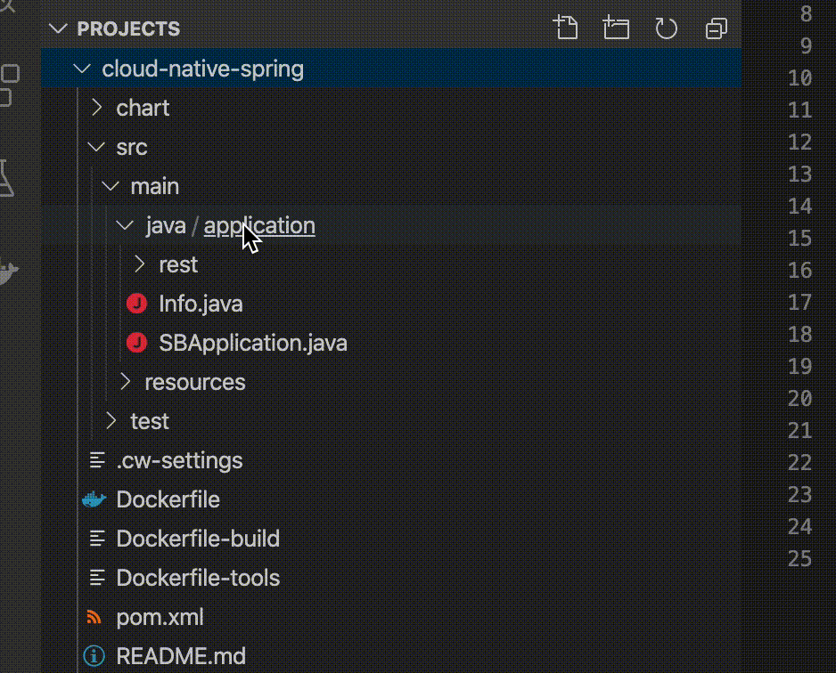

# Codewind Quicklab

Moving workloads to the cloud introduces a steep learning curve for developers accustomed to traditional web application developmenr. Cloud-native applications are usually containerized (either Docker or OCI containers) and are run on orchestrated platforms like Kubernetes. These are complex technologies that bring big changes to the development workflow. Can this be simplified? Can developers create cloud-native applicatioons and deploy them to Kubernetes without climbing the mountainous learning curve? 

In this quicklab we will take a look at an usecase involving Eclipse Codewind, a technology that simplify development of containerized cloud-native applications. Codewind is an IDE plugin that allows you to work with containerized applications in a familiar way. With Codewind, developers can start building cloud-native applications like experts without having to be an expert in all the cloud-native technologies. 

## Prerequistes

If you're running this lab on your own laptop, make sure you have a few things already installed.

<details>
  <summary>Click to expand</summary>
  
### Configure Local System

This quicklab requires the following tools: 

1. Docker
2. VS Code
3. VS Code Codewind [extension](https://www.eclipse.org/codewind/mdt-vsc-getting-started.html)

We recommend working with the latest available version of each.

</details>

## Improving Developer Productivity with Eclipse Codewind

[Eclipse Codewind](https://www.eclipse.org/codewind/) is a plugin for IDEs, currently available in VS Code, Eclipse, and Eclipse Che, that helps improve developer productivity when developing containerized applications. Let's explore how Codewind can help you be a more productive developer.

1. Open VS Code (press **command** + **space bar** and type "VS Code" into the dialog box)
2. In the explorer window under **CODEWIND** click on the "**+**" to create a new project


3. In the dialog pop-up search for "Spring Boot" and select the "Appsody Spring Boot default template" option


4. Enter **cloud-native-spring** as the project name and hit enter


### Automated Code Reload

A key to increasing developer productivity is shortening and reducing the friction in the feedback loop. Codewind improves your inner loop experience, enabling you to create a microservice quickly, rapidly iterate on changes and make improvements to performance. As you develop, Codewind *automatically* pushes your code changes to your container as efficiently as possible. 

Let's look at this feature in action.

1. 	In the project under **src/main/java/application** create a new file **Hello.java**

2. Edit **Hello.java** to look like below:
	
	```java
	package application;
	
	import org.springframework.web.bind.annotation.RequestMapping;
	import org.springframework.web.bind.annotation.RestController;
	import org.springframework.web.bind.annotation.RequestParam;
	import org.springframework.http.HttpStatus;
	import org.springframework.http.ResponseEntity;
	import org.springframework.web.bind.annotation.ResponseBody;
	import java.util.ArrayList;
	import java.util.List;
	
	@RestController
	public class Hello {
	
	    @RequestMapping("v1/hello")
	    public @ResponseBody ResponseEntity<String> example(@RequestParam("name") String name) {
	        List<String> list = new ArrayList<>();
	        //return a simple list of strings
	        String msg = "Hello " + name;
	        list.add(msg);
	        System.out.println("New message: " + msg);
	        return new ResponseEntity<String>(list.toString(), HttpStatus.OK);
	    }
	
	}
	```
3. You can view the status of the re-build and re-deploy by looking at the status indicator next to the project under the Codewind context. Once status returns to [Running][Build Suceeded] you can refresh your browser window to view the change we made. Please be aware that it can take a few seconds until something happens. 
		
4. In VS Code click the "Open Application" icon.	
5. Append `/v1/hello?name=Cloud%20Native%20Spring` to the end of the url.


### View the Performance Dashboard

You can run an application and use the performance dashboard data to determine whether the application is working harder than it should. By determining which applications are running harder than necessary, the performance dashboard can help you find slower applications and detect memory leaks.

You'll notice that if you try to run a load test with the default project configuration, you will not get any results on the performance dashboard. This is because not all projects will have the required packages needed to provide monitoring, Spring Boot being one of these projects. However, we provide the ability to auto inject the required configuration at build time to include these packages. You will need to opt in for this to happen as it will modify the source code (but only in the build container).

1. Navigate to the Project Overview page 
2. Enable "Inject metrics."  Wait for the Application Status to go back to Running - it shouldn't take long.
3. Navigate to the Performance Dashboard. 
4. Now you can run a load test and monitor your application. 

## Other Actions
### View the Application Monitor
Opening the Application monitor allows you to monitor the activity and health of your application. This action is only available when the application is running or debugging.


### Viewing Application Logs

Viewing the logs of your application running in a docker container is easy from the IDE with Codewind. 

To view the logs for an application, right click on it and select "Show All Logs" 


The logs for the running application will be shown in the IDE console log window on the bottom right of the page. 
